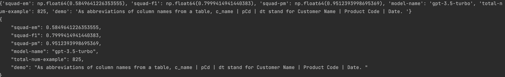
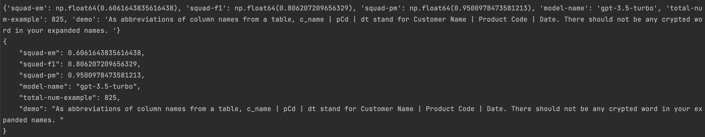
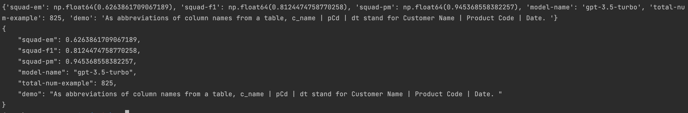
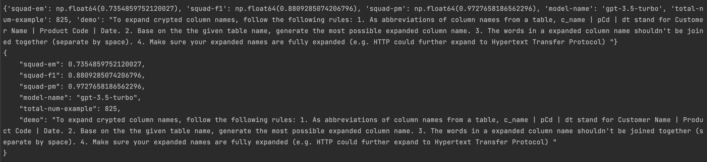

# Installation

To install the required packages, run:

```bash
pip install -r requirements.txt
python -m spacy download en_core_web_sm
```

Remember to add OPENAI_API_KEY as an environment variable:
```bash
export OPENAI_API_KEY=[key_value]
```

# Current Result
## Most Basic Prompt (Baseline)

## Prompt with Table Name (Worse than Basic Prompt)
### Reason for this:
Adding table information might help what table the column belongs to, giving the LLM more context.
### Result:


## Prompt with extra string "There should not be any crypted word in your expanded names. " (Slightly Better than Basic Prompt)
### Reason for this:
Some columns are still in abbreviated form after the expansion.
### Result:


## Prompt with extra string "Every single word in the column names should be expanded. " (Slightly Better than Basic Prompt)
### Reason for this:
Some columns are still in abbreviated form after the expansion.
### Result:


## Prompt with a sequence of steps (Decent Improvement Compared to Baseline)
### Prompt:
"To expand crypted column names, follow the following rules: "
            "1. As abbreviations of column names from a table, c_name | pCd | dt stand for Customer Name | Product Code | Date. "
            "2. Based on the given table name, generate the most possible expanded column name. "
            "3. The words in a expanded column name shouldn't be joined together (separate by space). "
            "4. Make sure your expanded names are fully expanded (e.g. HTTP could further expand to Hypertext Transfer Protocol) "
### Reasons for this:
1. Table names are joined, so if simply feed table names, LLM generates joined column names sometimes
2. Sometimes column names are partially expanded
### Result:


# Project Proposal for CS 774

## Team ID: 2
**Member Names:** Ying-Fang Jaw, Hau-Cheng Yang, Zhengguang Zhou

## 1) Problem Description
In many real-world databases, table names and column names are often used cryptically—for example, `EmpN` might stand for "Employee Name." Such cryptic names can make the data harder to understand and use, especially when sharing with colleagues or integrating it with other systems.

Our proposed solution, **S**, will focus on automatically cleaning and standardizing these table and column names utilizing Large Language Models (LLMs) based on a provided mapping of cryptic names to more descriptive, human-readable names. We will then integrate these renamed fields back into a cleaner version of the database schema.

### Input:
- A dataset (or database schema) containing original cryptic names (e.g., column names, table names).

### Output:
- A set of cleaned table and column names that replace or expand abbreviations/cryptic codes into meaningful, descriptive terms (e.g., `EmpN` → `Employee_Name`).

In practice, the program **P** implementing **S** will be designed to work on specific database schemas that follow the expected format. It will use the mapping as a reference to clean and standardize table and column names. The cleaned schema will be returned as output.

## 2) Data
We plan to use existing datasets that contain cryptic table and column names, along with a corresponding reference list of correct, descriptive names. This reference mapping will serve as the gold standard for evaluating our solution.

Since accurate name mapping is crucial for this task, the provided reference list will act as our primary dataset for both training and evaluation. If there are missing or newly discovered cryptic labels, we will use automated techniques—such as text similarity or LLM-driven inference to expand the mapping, rather than relying on manual verification.

We have four datasets from the professor. We will use some of them to evaluate our results. Two of them are like the following:

- **AdventureWorks I** – This dataset contains 825 rows from the AdventureWorks database, with column names using abbreviations and concatenations, such as `DbVersion` (database version), `ModDate` (modified date), and `SysInformationID` (system information identifier). Standardization is needed for clarity and consistency.
- **AdventureWorks II** – Also with 825 rows, this dataset features different column name variations, such as `SId` (system identifier) instead of `SysInformationID` and `DbVer` (database version) instead of `DbVersion`. Aligning these inconsistencies ensures uniformity across datasets.

## 3) Performance
To measure how accurately our solution renames cryptic labels, we plan to compute:

- **Precision**: Among all the renamed table and column names, how many are correct matches to the reference (gold) names?
- **Recall**: Among all the cryptic labels that needed cleaning, how many are correctly renamed according to the reference?
- **Overall Accuracy**: The fraction of total cryptic labels that are correctly renamed.

Additionally, for any “difficult” or ambiguous cases, we may allow partial matches (e.g., partial string similarity or fuzzy matching) to handle situations where a name is partially correct but missing small details.

## 4) Challenges
- **Incomplete Mapping**: The reference list may not always be comprehensive, forcing the solution to guess. We will build alternative strategies (e.g., checking synonyms, employing text processing techniques, or employing LLM capabilities and synonym matching to intelligently guess or predict missing labels) to handle such cases.
- **Case Sensitivity**: Defining what counts as a correct match when letter cases differ. For example, `EmployeeID` vs. `EMPLOYEEID` might refer to the same concept but appear in different formats. We will establish a consistent rule for handling case variations, ensuring that corrections are applied uniformly without introducing unintended mismatches.
- **Ambiguity in Acronyms and Abbreviations**: Acronyms or abbreviations can have multiple meanings depending on the context (e.g., `DOB` could mean "Date of Birth" or "Department of Budget"). We plan to utilize context-aware capabilities of LLMs to resolve such ambiguities.
- **LLM Prompt Optimization**: Designing effective prompts for LLMs to reliably generate meaningful name expansions can be challenging. We will iteratively refine and optimize our prompts through experimentation.
- **Computational Efficiency**: Leveraging LLMs can introduce significant computational overhead. We will explore strategies to balance accuracy and performance, including prompt engineering, caching, or selective invocation of LLMs.

## 5) Hardware and Software
### **Hardware:**
We plan to utilize the GPU resources provided by the school to improve the efficiency of our solution. This will help accelerate any computationally intensive tasks.

### **Software:**
We plan to use Python (with libraries such as Pandas, scikit-learn for potential text processing or fuzzy matching). If needed for fuzzy matching, we may also use additional packages like `fuzzywuzzy` or `RapidFuzz`. All of these tools are easily obtainable as open-source libraries. We will also access Large Language Model APIs such as OpenAI's GPT-4 for advanced language processing.

## 6) Timeline
| Week  | Task |
|-------|------|
| 1     | Finalize project scope. Analyze the dataset and gold reference. |
| 2-3   | Develop and implement the initial heuristic cleaning algorithm. Apply it to the test set to compute a baseline accuracy. |
| 5-6   | Integration and experimentation with Large Language Models for advanced name cleaning and standardization. Evaluate the accuracy of the advanced model on the test set. |
| 7     | Compare the performance of the simple algorithm and the advanced model. Analyze cases where the advanced model fails and try to improve them. Finalize system and prepare final report. |

## 7) Misc
We may also explore how frequently cryptic names appear in different industries or data sources if time permits.
